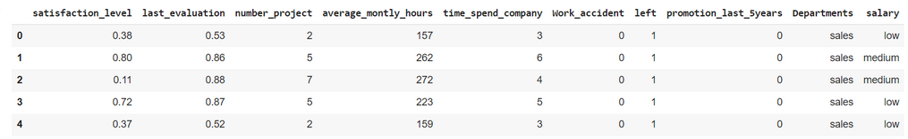

# Implementation-of-Decision-Tree-Classifier-Model-for-Predicting-Employee-Churn

## AIM:
To write a program to implement the Decision Tree Classifier Model for Predicting Employee Churn.

## Equipments Required:
1. Hardware – PCs
2. Anaconda – Python 3.7 Installation / Jupyter notebook

## Algorithm
1. First Import the required Libraries.
2. ThenUpload the dataset in the compiler and read the dataset.
3. Find head,info and null elements in the dataset.
4. Using LabelEncoder and DecisionTreeClassifier , find accuracy and prediction for the
dataset.
5. End the program.

## Program:
```
/*
Program to implement the Decision Tree Classifier Model for Predicting Employee Churn.
Developed by: MADHAN BABU P
RegisterNumber:  212222230075
*/
import pandas as pd
data=pd.read_csv("/Employee.csv")
data.head()

data.info()

data.isnull().sum()

data["left"].value_counts()

from sklearn.preprocessing import LabelEncoder
le=LabelEncoder()

data["salary"]=le.fit_transform(data["salary"])
data.head()

x = df[["satisfaction_level","last_evaluation","number_project","average_montly_hours","time_spend_company","Work_accident","left","promotion_last_5years","Departments ","salary"]]

x.head()

y=data["left"]

from sklearn.model_selection import train_test_split
x_train,x_test,y_train,y_test=train_test_split(x,y,test_size=0.2,random_state=100)

from sklearn.tree import DecisionTreeClassifier
dt=DecisionTreeClassifier(criterion="entropy")

dt.fit(x_train,y_train)
y_pred=dt.predict(x_test)

from sklearn import metrics
accuracy=metrics.accuracy_score(y_test,y_pred)
accuracy
dt.predict([[0.5,0.8,9,260,6,0,1,2]])
```

## Output:
## Value of data.head()

## Value of data.info()

## data.isnull() and sum()

## data.counts()

## Salary data.head()

## x.head()

## Value of accuracy

## data predicton value


## Result:
Thus the program to implement the  Decision Tree Classifier Model for Predicting Employee Churn is written and verified using python programming.
